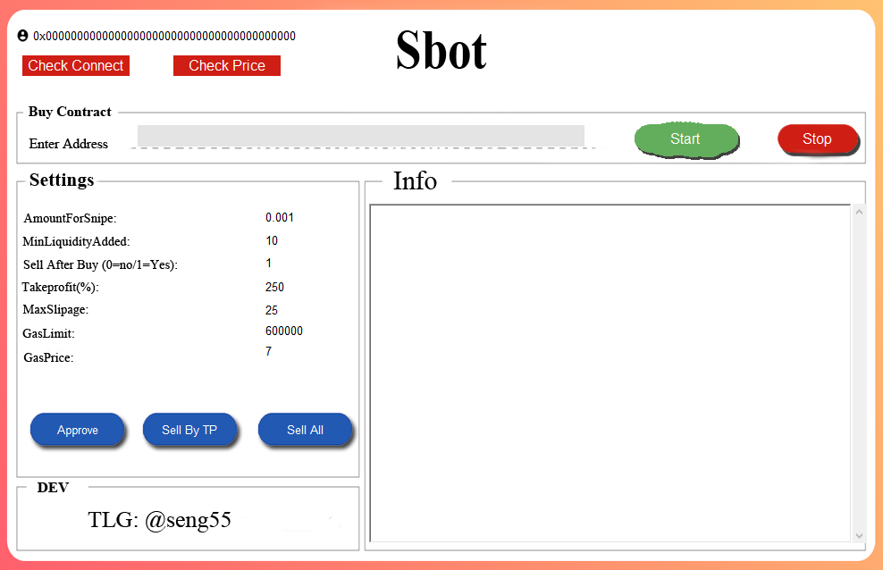
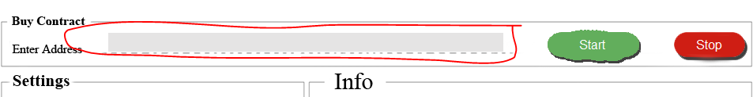

Pancakeswap sniper bot

* NOW THE BOT IS POSSIBLE FOR BSC: PANCAKESWAP (DEFAULT)
  YOU CAN USE TO ANY DEFI SAME <code>UNISWAP V2 AND PANCAKESWAP V2</code>, BUT YOU NEED TO CHANGE pairabi, pancakeABI AND pancakeSwapFactoryABI

 
*IMPORTANT NOTES BEFORE RUNNING THE BOT
 CHECK TOKEN YOU WANT TO SNIPER IT NOT SCAM OR HONEYPOT (<code>90% NEW TOKEN CAN BE SCAM</code>)

* NEW UPDATES
1. In this new update you can use BNB instead WBNB. it will make you easier to snipe :)

*Demo for SY bot:
1. You can <code>Approve</code>
2. Check liquidity & check <code>BUY & Sell</code>
3. Check <code>real price</code>
4. You <code>can't</code> send transcription 

*Real for SY bot:
You can Use <code>full</code>
1. SY Developer : <code>https://t.me/seng55</code>
2. website : <code>https://pancakesbot.com/</code>

*What's will you get
To avoid scam, I will invite you to my private repository, aTo avoid scam, I will invite you to my private repository, and you will get whole of code, and any update if I push new update. Please only contact to Telegrame:<code>@Seng55</code> or <code>eeyang5@gmail.com</code> with subject <b>SY Bot Info</b> for more info. For error or problem questions please open issues in GitHub, don't email me. Maybe I'll slow response on weekend. Thanks!

*Bot future
1. You can snipe <code>new listing token on pancakeswap v2</code> or any defi like pancakeswap v2 (See how to on above)
2. <code>Sell</code> ALL you token 
3. Sell you token by <code>TakeProfit or Selllimt</code> (Capital is AmountForSnipe)
3. <code>Approve </code>
4. Check <code>Real price</code>

*How sniper work ?
1. When liquidity added Bot will <code>auto buy and sell</code> when profit more than takeprofit (Please <code>Approve</code> before Sniper)

* HOW TO RUN
1. set up your <code>config.py</code> to with this explanation : 
----------------------------------------------------------
walletAddress = "0x0000000000000000000000000000000000000000"                     #Your Wall address From trustwallet or another wallet.  
private_key = "x000000000000000000000000000000000000000000000000000000000000000" #Wallet private_key  

spend = "0xbb4cdb9cbd36b01bd1cbaebf2de08d9173bc095c"  # WBNB OR OTHER contract for buy the token  

AmountForSnipe = 0.0024  # Amount how much you want buy the token in WBNB OR OTHER. 
MinLiquidityAdded = 5  # Set how much minimum liquidity added in pair address that you want to buy. set in WBNB OR OTHER. (eg : 2, 4, 7). 2 mean 2 BNB liquidity added. 

SellToken = 0   # 0 = Not Sell after buy, 1 = Sell token after buy by take profit 
Takeprofit = 150 # On percent 

transactionRevertTime = 1000 #Limit for make transaction 
gasAmount = 400000 #Minimul limit is 210000, more much more better. 
gasPrice = 5 #Customize your GWEI (gas fee) here, cannot decimal. (eg : 5, 10, 25). 

bscScanAPIKey= "XXXXXXXXXXXXXXXXXXXXXXXXX" #Your BSC API Key Get From https://bscscan.com 

pancakeSwapRouterAddress = "0x10ED43C718714eb63d5aA57B78B54704E256024E"          #pancakeSwapRouterAddress 
pancakeSwapFactoryAddress = "0xcA143Ce32Fe78f1f7019d7d551a6402fC5350c73"         #pancakeSwapFactoryAddress 
bsc = "https://bsc-dataseed.binance.org/"                                        #BSC JSON-RPC 

-------------------------------------------------

2. run with <code>SY_Bot_Client.exe</code> include Insert and console windows. 

3. Insert Token Contract you want to sniper, than press <code>Sniper Start</code> You will see any working on console windows 
   
   
8. Stop bot with <code>Stop Running</code>.

## WARNING
The not guarantee make profit every token you snipe, do you research token info before run

## TROUBLESHOOT
* there are some reason if your tx failed :
- you haven't approve your WBNB or Any Token you want to buy or sell
- your gas price are to small
- your GWEI are to small (BSC use 7+ for fast)

